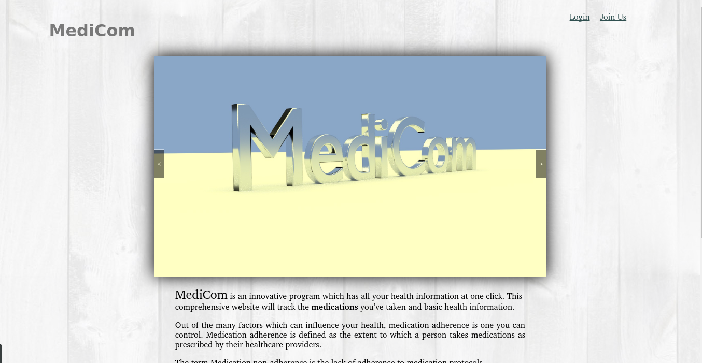
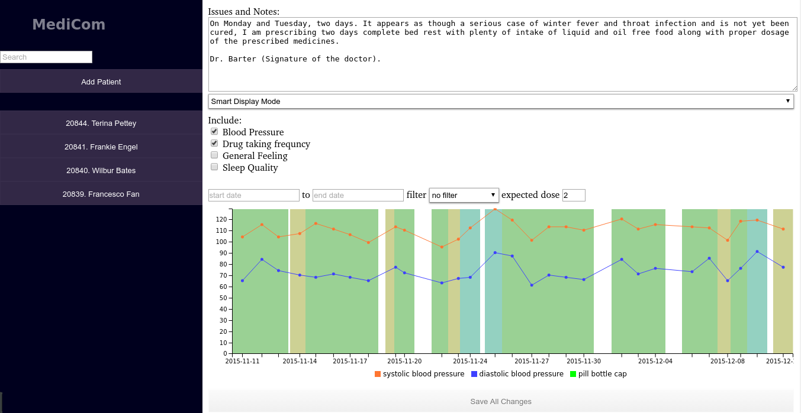
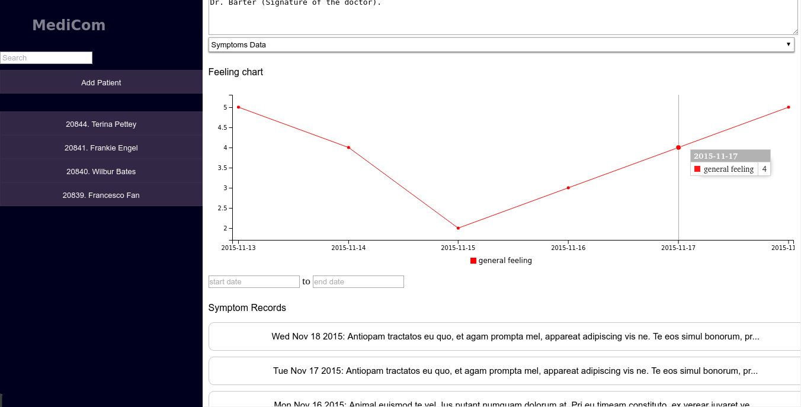
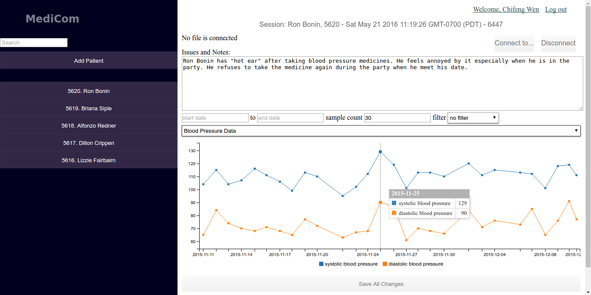
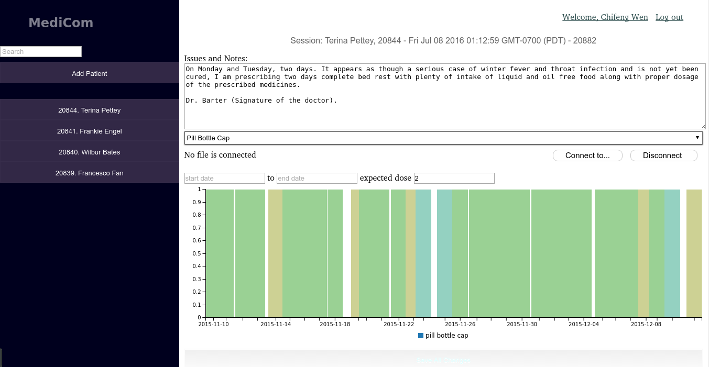

# medicom
A tool to research the factors that influence patients' medical adherence.

### Our site
medicom.calit2.uci.edu

### Collaboration of various types of medical data.

### Collecting symptoms from mobile app over a period of time.

### BP measurements.

### Pill bottle cap records.

### Medical sessions management.
