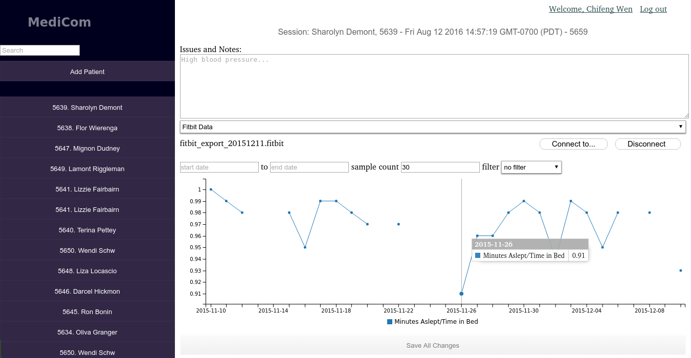

# MediCom
A tool to research the factors that influence patients' medical adherence.

###### Mentors: John Billimek, Sergio Gago, Anmol Rajpurohit.
###### Thomas Huang, Marta Ramos, Tatiana Sarkhosh, Chifeng Wen

###### The United States of America (USA) has the highest health care cost inflation among leading developed nations. From 2006 to 2010, healthcare costs in the USA increased by a staggering 19%. Even more importantly, the overspending in healthcare in the USA due to overuse is estimated to be $750 billion. It is deeply perplexing to see such statistics for a nation whose talented healthcare providers and technology are among the world’s best. One of the most promising solutions is patient-centered healthcare. More than half of patients nationwide do not take their medications as prescribed, yet a very small minority of those patients discusses the concerns about their medication to the healthcare provider. Our method to increase patient accountability is MediCom, a multiplatform experience for users to access on computers, tablets, and smartphones. Our objective was to identify a set of technologies that could collect health information. We tested health collection devices that could track information and export data as a .csv file. Our team tested step trackers, pill bottle cap counters, blood pressure monitors, blood sugar self-testing devices, and phone applications. We chose devices based on cost, convenience, size, ease of exporting, and sharing capabilities. We incorporated the data the devices tracked into our phone application and website. The data is presented as a chart for both patients and doctors to use. 

### Our site
[http://medicom.calit2.uci.edu](http://medicom.calit2.uci.edu)

### Collaboration of various types of medical data.

### Collecting symptoms from mobile app over a period of time.

### BP measurements.

### Pill bottle cap records.

### Measuring sleep quality from fitbit records.

### Medical sessions management.
